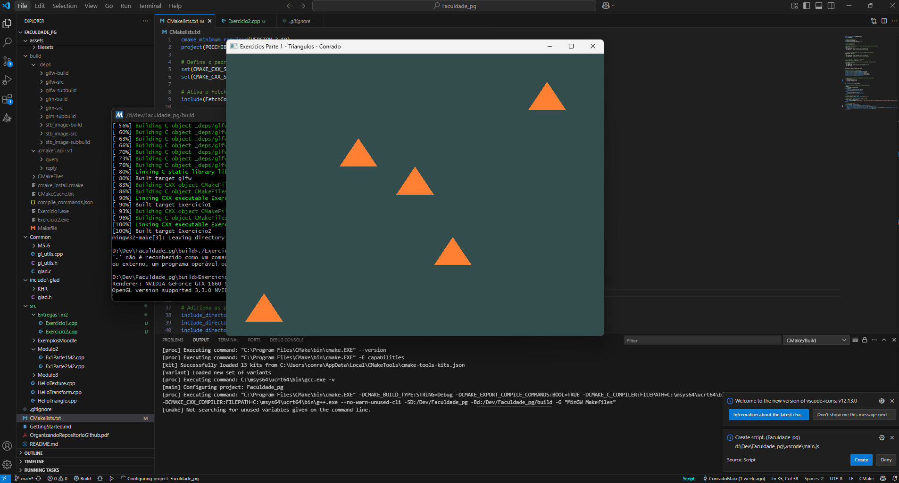
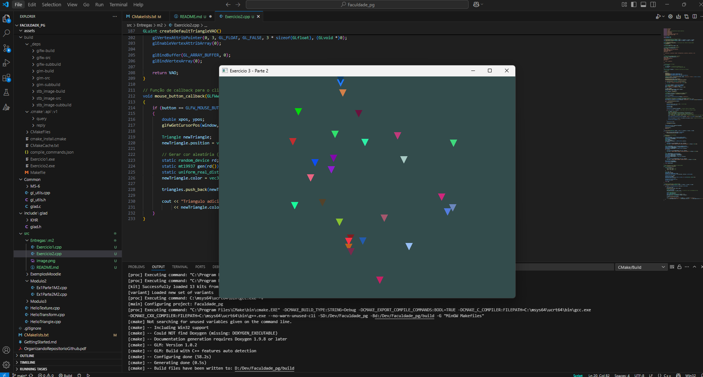

# Exercícios Módulo 2

## Exercício 1
Implementação da função `createTriangle` que cria um triângulo com coordenadas específicas. A função recebe as coordenadas dos três vértices e retorna o VAO do triângulo.



## Exercício 2
Criação de 5 triângulos na tela usando a função do Exercício 1. Os triângulos são posicionados em diferentes locais:
- Canto inferior esquerdo
- Centro-direita inferior
- Centro-esquerda superior
- Canto superior direito
- Centro da tela



## Como Executar
1. Na pasta build:
```bash
cmake .. -G "MinGW Makefiles"
mingw32-make
```
2. Execute os programas gerados