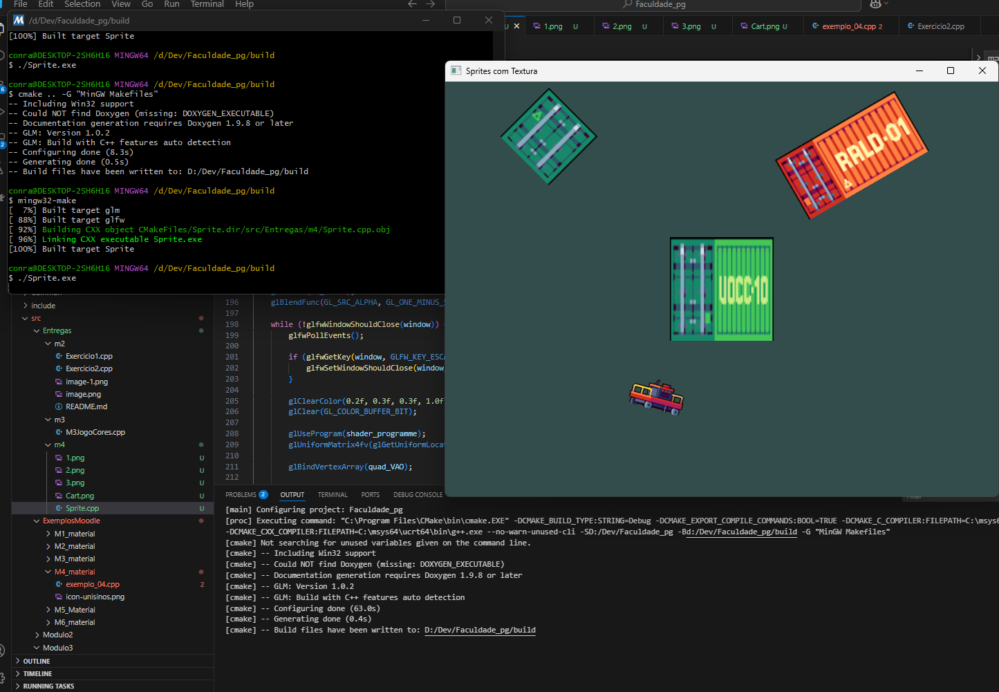

# M4 - Tarefa | Instanciando objetos texturizados

Este programa, desenvolvido como parte da disciplina de Processamento Gráfico, utiliza OpenGL moderno para renderizar múltiplos sprites (retângulos texturizados) em uma janela 800x600. Cada sprite possui posição, escala e rotação específicas. Foram utilizados shaders personalizados e projeção ortográfica para facilitar o mapeamento para coordenadas de tela. Quatro sprites foram renderizados, demonstrando o uso de múltiplas texturas e transformações.

## Resultado

