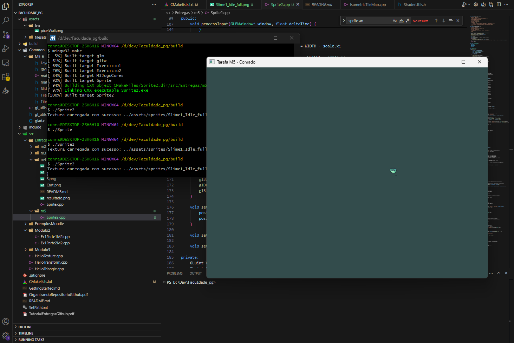

# M5 - Tarefa | Controle e Animação de Sprites

Este programa, desenvolvido como parte da disciplina de Processamento Gráfico, utiliza OpenGL moderno para renderizar e controlar um personagem sprite. Ele gerencia a animação do personagem a partir de uma spritesheet, permitindo que o usuário o mova pela tela usando as teclas WASD, com as animações mudando de acordo com a direção do movimento, e garantindo que o personagem permaneça dentro dos limites da janela.

## Resultado

